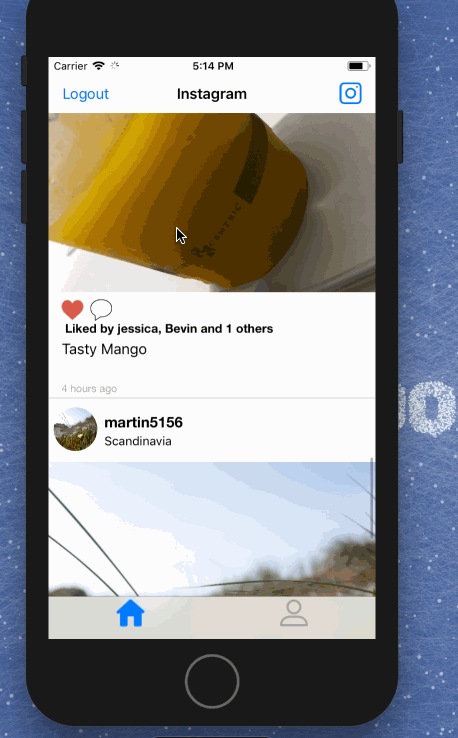

# Project 4 - *Instagram*

**Instagram** is a photo sharing app using Parse as its backend.

Time spent: **32** hours spent in total

## User Stories

The following **required** functionality is completed:

- [x] User can sign up to create a new account using Parse authentication
- [x] User can log in and log out of his or her account
- [x] The current signed in user is persisted across app restarts
- [x] User can take a photo, add a caption, and post it to "Instagram"
- [x] User can view the last 20 posts submitted to "Instagram"
- [x] User can pull to refresh the last 20 posts submitted to "Instagram"
- [x] User can tap a post to view post details, including timestamp and caption.

The following **optional** features are implemented:

- [x] Run your app on your phone and use the camera to take the photo
- [x] Style the login page to look like the real Instagram login page.
- [x] Style the feed to look like the real Instagram feed.
- [x] User can use a tab bar to switch between all "Instagram" posts and posts published only by the user. AKA, tabs for Home Feed and Profile
- [x] User can load more posts once he or she reaches the bottom of the feed using infinite scrolling.
- [x] Show the username and creation time for each post
- [x] After the user submits a new post, show a progress HUD while the post is being uploaded to Parse
- User Profiles:
- [x] Allow the logged in user to add a profile photo
- [x] Display the profile photo with each post
- [x] Tapping on a post's username or profile photo goes to that user's profile page
- [x] User can comment on a post and see all comments for each post in the post details screen.
- [x] User can like a post and see number of likes for each post in the post details screen.
- [ ] Implement a custom camera view.

The following **additional** features are implemented:

- [x] Password input text is hidden
- [x] When logging in fails, an alert is shown
- [x] Infinite scrolling adds new posts to bottom of table instead of reloading entire table, allowing for smooth scrolling
- [x] When sucessfully posting an image, the feed updates to show the new image
- [x] Users can also unlike posts
- [x] When updating a profile pic after clicking on a user's own post, the profile pic on the user tab is also updated and vice versa
- [x] Posting increases the post counter on the users profile page
- [x] Comments have profile pics and usernames
- [x] Users can access comments from both feedview and detailed view
- [x] All actions that require loading UI have personalized loading screens 
- [x] Users can view detail view of post by clicking on grid cell of profile view
- [x] Detail view also allows users to like and view comments
- [x] Users can click on the edit profile button on their profile to edit their name and their bio
- [x] When updating profile, both the feed and the profile page are updated with the new data
- [x] Profile page displays username on header
- [x] Edit profile button is only shown if user is on own profile page, whether through tab or by clicking on picture
- [x] Each post on feed and on detail view has a "View (#number of comments) comments" label that updates whenever user comments
- [x] When posting a comment, the textbox is cleared. Users cannot post empty comments
- [x] follower/following count is random
- [x] When posting a new gram, the feed automatically moves to the top to show the new post
- [x] When there are two or more likes, the usernames of the first two likes are displayed

Please list two areas of the assignment you'd like to **discuss further with your peers** during the next class (examples include better ways to implement something, how to extend your app in certain ways, etc):

1.
2.

## Video Walkthrough

Here's a walkthrough of Logging in, infinite refresh, and pull to refresh.

Here's a walkthrough accessing the detail view both by clicking on a feed post and by clicking on a post on a user's profile.

Here's a walkthrough of implemented user stories:

Here's a walkthrough of implemented user stories:

Here's a walkthrough of signing up as a new user and editing profile:

GIF created with [LiceCap](http://www.cockos.com/licecap/).

## Credits

List an 3rd party libraries, icons, graphics, or other assets you used in your app.

- [AFNetworking](https://github.com/AFNetworking/AFNetworking) - networking task library

## Notes

Describe any challenges encountered while building the app.

## License

Copyright [yyyy] [name of copyright owner]

Licensed under the Apache License, Version 2.0 (the "License");
you may not use this file except in compliance with the License.
You may obtain a copy of the License at

http://www.apache.org/licenses/LICENSE-2.0

Unless required by applicable law or agreed to in writing, software
distributed under the License is distributed on an "AS IS" BASIS,
WITHOUT WARRANTIES OR CONDITIONS OF ANY KIND, either express or implied.
See the License for the specific language governing permissions and
limitations under the License.
